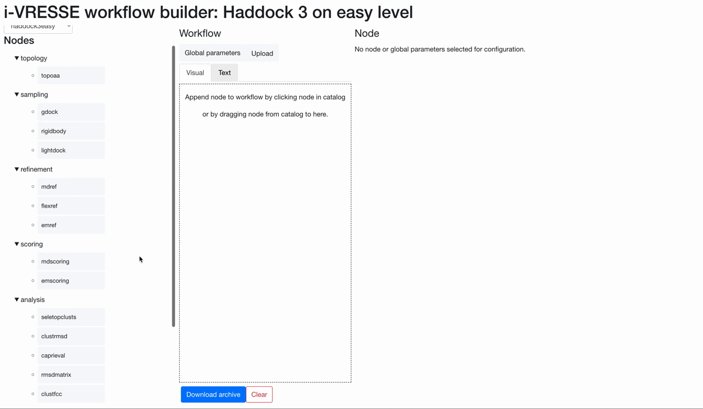

# workflow-builder

Graphical interface to build a workflow file

[](https://app.netlify.com/sites/wonderful-noether-53a9e8/deploys)
[](https://github.com/i-VRESSE/workflow-builder/actions/workflows/node.js.yml)

The main branch is published at https://wonderful-noether-53a9e8.netlify.app/

The builder allows you to create a complex TOML formatted config file based on a set of JSON schemas.
It can have parameters inside the config file that reference files.
The config file together with the referenced files can be downloaded or uploaded as a zip archive.



## Develop

Requires [NodeJS](https://nodejs.org/) and [yarn](https://yarnpkg.com/).

```shell
# Install dependencies
yarn

# Run dev server
yarn dev
# Goto http://localhost:3000
```

### Tests

Tests (**/*.test.tsx?) written in [vitetest](https://vitest.dev/) (a test framework similar to [jest](https://jestjs.io/)) can be run with:

```shell
yarn test run
```

To run tests with code coverage use

```shell
yarn  test run --coverage
```

Creates `coverage/` directory with HTML and LCOV report.

### Linting

```shell
yarn lint
```

To autofix lint errors use

```shell
yarn lint --fix
```

To generate JSON report use

```shell
yarn lint --report json > eslint.report.json
```

### Build

To build production distribution run

```shell
yarn build
```

Which will create `dist/` directory which should be hosted on the web somewhere.

### Component development

Components can be developed/tested/documented using [storybook](https://storybook.js.org/).

Storybook can be started with

```shell
yarn storybook
```

## Format

### Workflow archive

The workflow builder creates a zip file with a workflow configuration file called `workflow.cfg` in a [TOML format](https://toml.io).
The configuration file contains paths to input files which are included in the zip file.

## Workflow configuration file

The workflow configuration file consists out of 2 parts:

1. Global parameters, which are available to engine and each node.
2. Tables with parameters for each node the workflow should run.

TOML does not allow for tables with same name. So any node that occurs multiple times should have a index appened to the table name.

### Catalog

The catalog is a YAML formatted file which tells the app what nodes are available. In has the following info:

1. global: Description of global parameters
    * schema: What parameters are valid. Formatted as JSON schema draft 7.
    * uiSchema: How the form for filling the parameters should be rendered.
    * tomlSchema: How toml keys are mapped to in-memory representation.
2. nodes: Description of available nodes.
    * id: Identifier of node, for computers
    * label: Label of node, for humans
    * category: Category to which node belongs
    * description: Text describing what node needs, does and produces.
    * schema: What parameters are valid. Formatted as JSON schema draft 7.
    * uiSchema: How the form for filling the parameters should be rendered.
    * tomlSchema: How toml keys are mapped to in-memory representation.
3. catagories: Descriptions of node categories
    * name: Name of category
    * description: Description of category
4. examples: Title and link to example workflows
    * map with title as key and link as value
5. title: Title of the catalog

### schema

See [docs/schema.md](docs/schema.md).

#### uiSchema

See [docs/uiSchema.md](docs/uiSchema.md).

### tomlSchema

See [docs/tomlSchema.md](docs/tomlSchema.md).

### Catalog index

In the worklfow builder you can pick a catalog from a list. This list gets downloaded from [public/catalog/index.json](public/catalog/index.json) and is formatted like

```json
[
    ["<title of catalog>", "<URL of catalog YAML file>"]
]
```

The first catalog in the index.json file will be shown when you open the app.
